# Text Narrator – Serverless Text-to-Speech Application

## Overview

This project is a fully serverless **Text-to-Speech web application** built on AWS. It allows a user to enter text in a web browser and receive spoken audio generated using **Amazon Polly**.

The application uses modern AWS managed services and follows best practices such as:
-   Serverless architecture (no servers to manage).
-   Secure access to audio files using presigned URLs.
-   Separation of frontend and backend concerns.
    
----------

## High-Level Architecture

**User → Web UI → API Gateway → Lambda → Amazon Polly → Amazon S3 → User**

1.  The user enters text in a web interface.
2.  The frontend sends the text to an API endpoint.  
3.  AWS Lambda processes the request.   
4.  Amazon Polly converts text to speech.
5.  The audio file is stored in Amazon S3.
6.  A temporary pre-signed Amazon S3 URL is returned to the client.
7.  The browser plays the audio.
    
----------

## AWS Services Used

-   **AWS Amplify** – Hosts the static frontend website.
-   **Amazon API Gateway** – Exposes a public HTTP API endpoint.
-   **AWS Lambda** – Backend logic for processing text and calling Polly.
-   **Amazon Polly** – Text-to-Speech service.
-   **Amazon S3** – Stores generated audio files.
-   **AWS IAM** – Provides permissions for Lambda to access Polly and S3.
    
----------

## Repository Structure

- `backend/lambda/` – AWS Lambda function for text-to-speech processing.
- `frontend/` – Static HTML/CSS/JavaScript frontend.
- `images/` – Architecture diagrams and UI screenshots.
- `videos/` – Demo walkthrough.

----------

##  Development Approach

This project was built incrementally in clearly defined stages, rather than starting with a web application immediately. Each stage was validated before moving to the next, ensuring that the underlying services worked correctly before adding complexity.

The overall progression was as follows:
1.  Explore Amazon Polly directly.
2.  Build a Lambda-based text-to-speech workflow.
3.  Store generated audio in Amazon S3.
4.  Test functionality using Lambda test events.
5.  Expose the backend using API Gateway.
6.  Test the application locally.
7.  Deploy the frontend using AWS Amplify.

----------
## How this was actually built

### 1. Create an IAM Role for Lambda

An IAM role was created to allow the Lambda function to interact with the AWS services required by the application. This role defines what the function is allowed to do and keeps permissions scoped to the backend only.

The role is trusted by the Lambda service and includes permissions to:
- Generate speech using Amazon Polly
- Store audio files in Amazon S3
- Write execution logs to CloudWatch

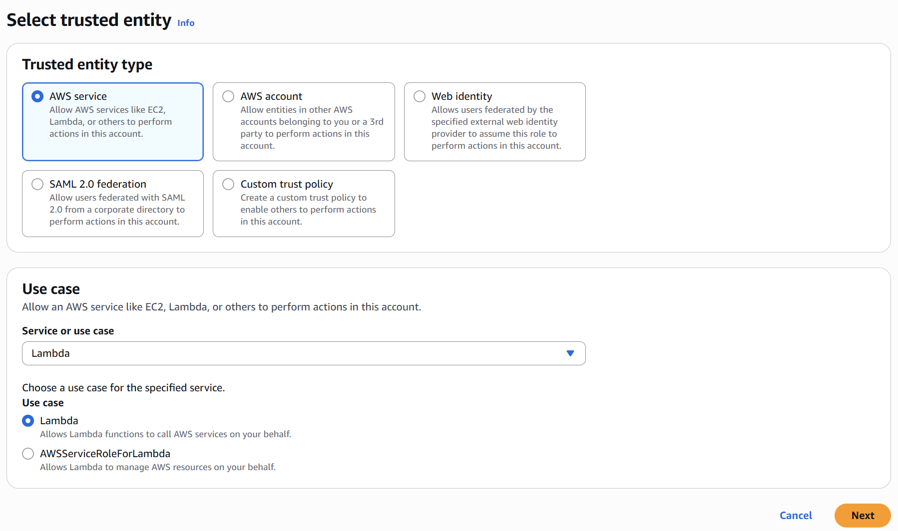

The following AWS-managed policies were attached to the role to support this functionality:

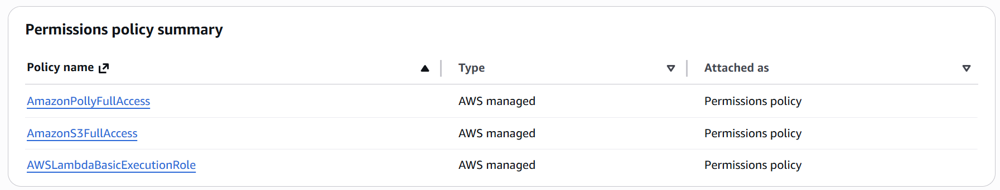

The role is named clearly to reflect its purpose and is reused by the Lambda function at creation time.

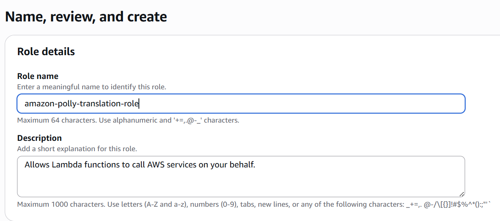

----------

###  2. Create an S3 Bucket

A private S3 bucket was created to store the audio files generated by Amazon Polly. Each request results in an MP3 file being written to this bucket.

The bucket is intentionally kept private. Instead of exposing objects publicly, access to audio files is granted using presigned URLs generated by the Lambda function. This avoids public access while still allowing the frontend to retrieve audio securely.

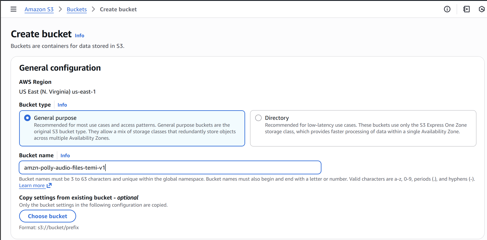

This approach keeps storage simple, secure, and easy to extend with lifecycle rules or encryption if needed.

----------

###  3. Create the Lambda Function

The backend logic is implemented as an AWS Lambda function written in Node.js. The function handles:
- Receiving text input
- Calling Amazon Polly to synthesize speech
- Uploading the generated audio to S3
- Returning a presigned URL to the caller

The function is created using an existing execution role to ensure permissions are explicitly controlled rather than relying on defaults.

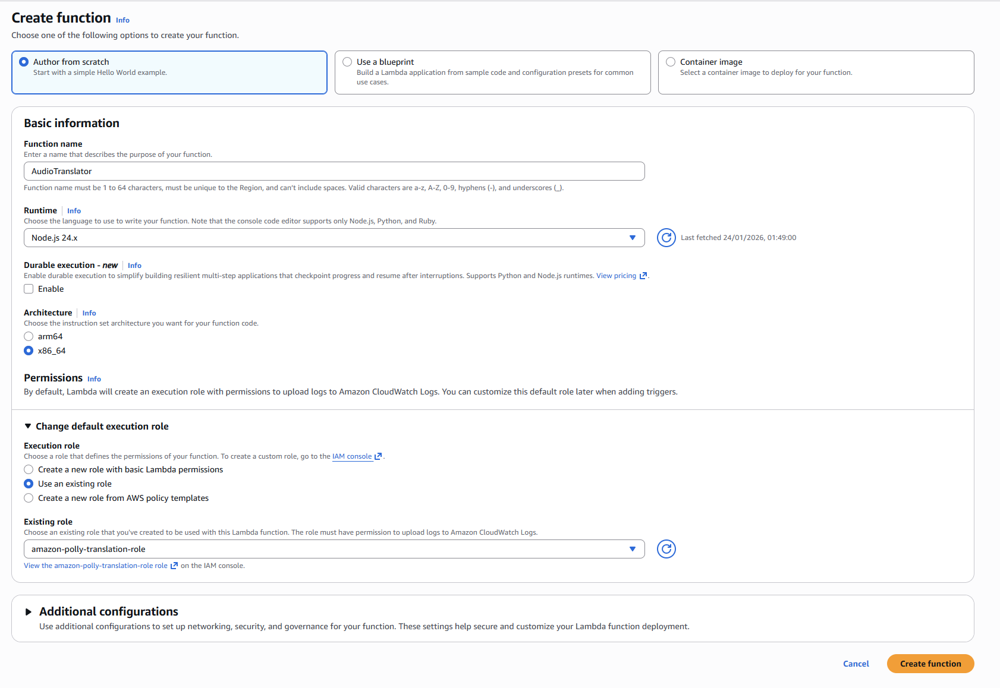

The default runtime and architecture are sufficient for this workload and keep the configuration minimal.

----------

###  4. Test the Lambda Function

Before exposing the function through an API, it was tested directly using Lambda test events. This allowed the text-to-speech workflow to be validated in isolation.

A successful test confirms that:
- The function executes without errors
- An MP3 file is generated and uploaded to S3
- The response confirms the stored object

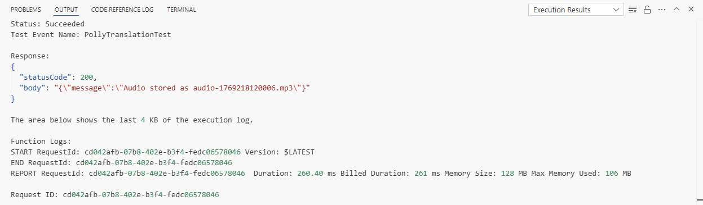

After execution, the generated audio file is visible in the S3 bucket, confirming the end-to-end backend flow.

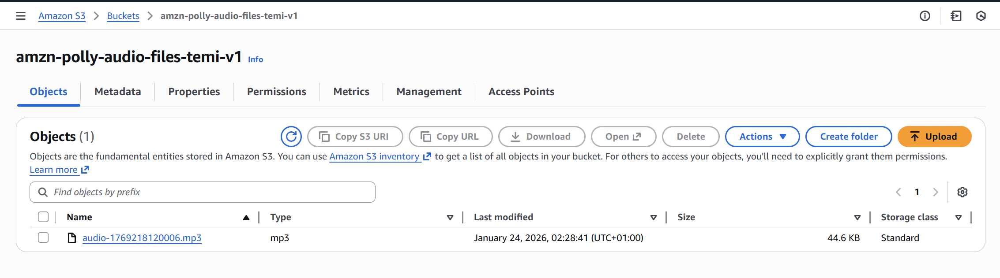
    
----------

###  5. Create an API Gateway

Amazon API Gateway exposes the Lambda function through a public HTTPS endpoint. An **HTTP API** is chosen to keep latency low while providing built-in CORS support for browser-based clients.

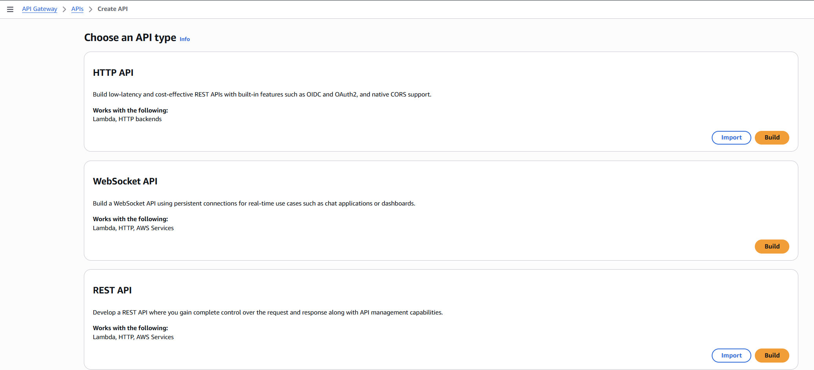

The Lambda function is added as an integration during API creation, allowing API Gateway to invoke the backend directly and return its response.

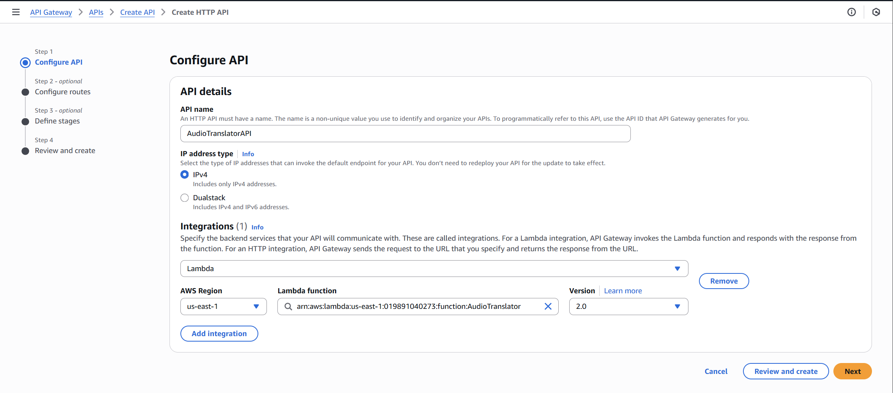

A single POST route is defined to accept text input from the frontend and forward it to the Lambda function.

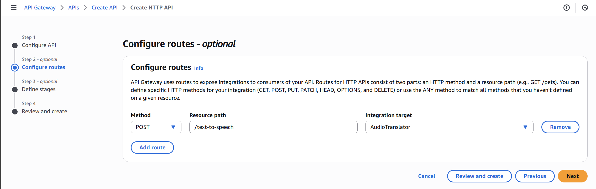

CORS is configured as part of the initial API setup to allow requests from any origin. This permissive configuration simplifies early development and testing before the frontend is deployed.

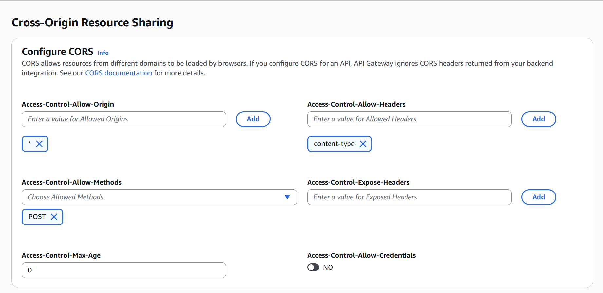

At this stage, the API is functional and accessible from browser-based clients without additional restrictions.

----------

###  6. Build the Frontend (HTML + JavaScript)

The frontend is implemented as a lightweight static web page using plain HTML, CSS, and JavaScript. It provides a simple interface where users can enter text and request audio generation.

The frontend:
- Captures user input
- Sends a POST request to the API Gateway endpoint
- Receives a presigned S3 URL in the response
- Plays the generated audio directly in the browser

No frontend frameworks are used. This keeps the application easy to reason about and ensures the focus remains on the backend architecture rather than tooling overhead.

----------

###  7. Host the Frontend Using AWS Amplify

AWS Amplify is used to host the static frontend and make it publicly accessible over HTTPS. Amplify was selected for its simplicity and built-in CDN support.

The application is deployed without a Git provider using Amplify’s manual upload option.

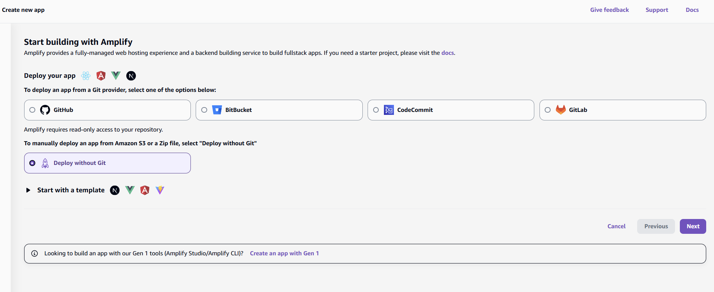

The frontend files are packaged into a ZIP archive with the entry HTML file at the root and uploaded directly to Amplify.

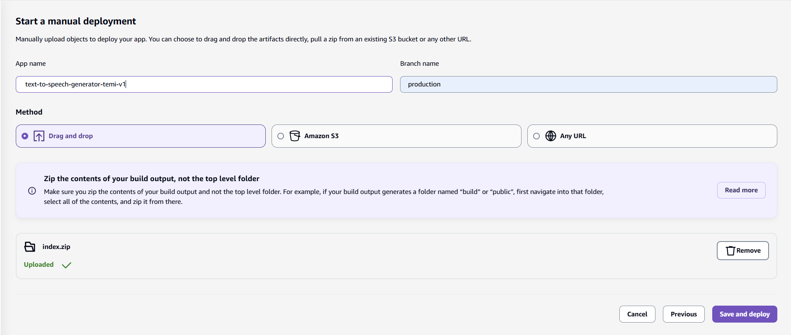

Once deployed, Amplify provides a globally accessible HTTPS URL backed by AWS infrastructure, allowing the frontend to be served securely without additional configuration.
    
**Note:** You can also host static sites using S3, but Amplify is recommended for simpler setup and built-in deployment features.

----------

###  8. Secure CORS Configuration

During early development, CORS is configured permissively to allow requests from any origin. This simplifies testing before the frontend is deployed.

Once the frontend is live, CORS settings are deliberately tightened. API Gateway is updated to replace the wildcard (`*`) origin with the Amplify-hosted frontend domain, ensuring that only requests from the deployed application are accepted.

In parallel, the Lambda function response is updated to return a matching `Access-Control-Allow-Origin` header. Aligning CORS configuration at both the API Gateway and Lambda levels prevents inconsistent browser behavior and reinforces frontend-only access to the API.

With these changes in place, only the hosted frontend can successfully call the API, reducing the risk of unintended or unauthorized usage.

----------

## Demo Video

A short walkthrough showing the full application flow, from entering text in the UI to playing the generated audio.

▶️ [Watch the demo video](videos/demo.mp4)

----------

## Key Design Decisions

-   **Presigned URLs** are used instead of public S3 access.
-   **HTTP API** is used instead of REST API for simplicity and cost.
-   **Serverless architecture** keeps costs low and scalability high.
-   **Amplify hosting** simplifies frontend deployment.
    
----------

## What This Project Demonstrates

- Designing and deploying a fully serverless AWS architecture
- Secure file access using S3 presigned URLs
- Clean separation between frontend and backend
- Practical use of managed AWS services in a real application

----------

## Conclusion

This project demonstrates how a complete, production-style serverless application can be built using AWS managed services alone. By validating each component independently and layering functionality step by step, the system stays simple while still addressing real-world concerns like security, scalability, and user experience.

Text Narrator reflects a practical approach to cloud development: choosing the right services, keeping responsibilities clearly separated, and avoiding unnecessary complexity. The same patterns used here can be applied to larger systems that require reliability, controlled access, and low operational overhead.
